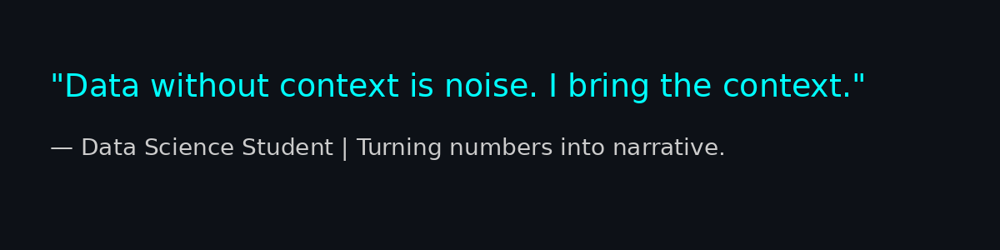

# 👋 Hi, I'm Ariel Politi

🎓 I'm a third-year Data Science student with a passion for turning raw data into impactful insights.  
💼 Currently looking for my first opportunity in the data industry — internships, junior data roles, or anything where I can grow and contribute.  
🧠 I enjoy solving real-world problems with code, curiosity, and coffee.

---

---

# 💻 Tech Stack:

---

### 📬 Let's Connect:

